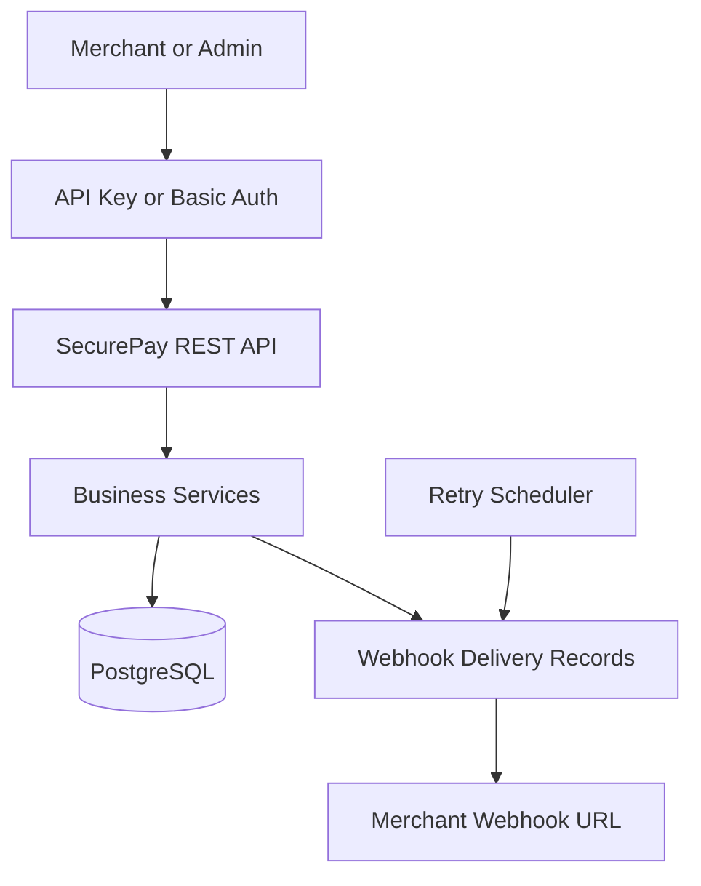

# SecurePay API

SecurePay is a merchant payment simulator built with Java and Spring Boot. It demonstrates payment creation, idempotent request handling, simulated payment processing, refunds, merchant authentication, admin authorization, signed webhooks, automatic delivery retries and payment monitoring.

> SecurePay is an educational portfolio project. It does not process real cards or move real money.

## Problem

Payment platforms must prevent duplicate charges, control payment state changes, support safe refunds and reliably notify merchants when transactions change.

SecurePay simulates these responsibilities through a secure REST API.

## Core Features

* Merchant registration
* Secure API-key generation and SHA-256 hashing
* Customer management
* Payment creation
* Idempotency-key protection
* Simulated successful and failed payments
* Partial and full refunds
* Over-refund prevention
* Payment status management
* Signed webhook events
* Automatic webhook retries
* Manual retry of failed webhooks
* Webhook delivery monitoring
* Merchant and admin roles
* Pagination and payment-status filtering
* Request validation and global exception handling
* Swagger/OpenAPI documentation
* PostgreSQL persistence
* Docker and Docker Compose
* Unit and integration tests
* GitHub Actions continuous integration

## Technology Stack

* Java 17
* Spring Boot 4
* Spring Web MVC
* Spring Data JPA
* Spring Security
* PostgreSQL
* Hibernate
* Maven
* Docker and Docker Compose
* JUnit 5
* Mockito
* Swagger/OpenAPI
* GitHub Actions

## Architecture



## Main Users

### Merchant

A merchant can:

* Register and receive an API key
* Configure a webhook URL
* Create and view customers
* Create payment requests
* Process simulated payments
* View and filter payments
* Request partial or full refunds
* Monitor webhook deliveries
* Retry failed webhooks manually

Merchants authenticate with:

```text
X-API-Key: sk_test_your_generated_key
```

### Admin

An admin can:

* View all merchants
* View and filter all payments
* View permanently failed webhook deliveries

Admins authenticate using HTTP Basic authentication.

## Payment Lifecycle

```text
PENDING → SUCCESSFUL
PENDING → FAILED

SUCCESSFUL → PARTIALLY_REFUNDED
SUCCESSFUL → REFUNDED
PARTIALLY_REFUNDED → REFUNDED
```

A completed payment cannot return to `PENDING` or be processed again.

## Idempotency

Payment creation requires an `Idempotency-Key` header:

```text
Idempotency-Key: order-1001
```

SecurePay handles repeated requests as follows:

```text
New key
→ Create a new payment

Same key and same payment details
→ Return the existing payment

Same key and different payment details
→ Return 409 Conflict
```

This protects merchants from accidentally creating duplicate payments.

## Refund Rules

* Only `SUCCESSFUL` or `PARTIALLY_REFUNDED` payments can be refunded.
* A refund amount must be greater than zero.
* Multiple partial refunds are allowed.
* Total refunds cannot exceed the original payment amount.
* A fully refunded payment becomes `REFUNDED`.
* Failed and pending payments cannot be refunded.

## Webhook Events

SecurePay produces these webhook events:

```text
PAYMENT_SUCCESSFUL
PAYMENT_FAILED
REFUND_SUCCESSFUL
```

Webhook requests contain:

```text
X-SecurePay-Signature
X-SecurePay-Event
```

Example payload:

```json
{
  "event": "PAYMENT_SUCCESSFUL",
  "paymentReference": "PAY-ABC123",
  "paymentAmount": 5000.00,
  "refundedAmount": 0.00,
  "currency": "NGN",
  "paymentStatus": "SUCCESSFUL",
  "occurredAt": "2026-09-25T10:00:00"
}
```

## Webhook Retry Policy

```text
Attempt 1 fails → retry after 10 seconds
Attempt 2 fails → retry after 30 seconds
Attempt 3 fails → mark as FAILED
```

A merchant can correct its webhook URL and manually retry a failed delivery.

## Important Endpoints

### Public

| Method | Endpoint                     | Purpose                  |
| ------ | ---------------------------- | ------------------------ |
| `POST` | `/api/v1/merchants/register` | Register a merchant      |
| `GET`  | `/actuator/health`           | Check application health |
| `GET`  | `/swagger-ui.html`           | Open API documentation   |

### Merchant

| Method | Endpoint                                           | Purpose                     |
| ------ | -------------------------------------------------- | --------------------------- |
| `PUT`  | `/api/v1/merchants/webhook`                        | Update webhook URL          |
| `POST` | `/api/v1/customers`                                | Create a customer           |
| `GET`  | `/api/v1/customers`                                | List customers              |
| `GET`  | `/api/v1/customers/{id}`                           | Retrieve a customer         |
| `POST` | `/api/v1/payments`                                 | Create a payment            |
| `GET`  | `/api/v1/payments`                                 | List and filter payments    |
| `GET`  | `/api/v1/payments/{reference}`                     | Retrieve a payment          |
| `POST` | `/api/v1/payments/{reference}/process`             | Process a simulated payment |
| `POST` | `/api/v1/payments/{reference}/refunds`             | Create a refund             |
| `GET`  | `/api/v1/payments/{reference}/webhooks`            | View webhook attempts       |
| `POST` | `/api/v1/payments/{reference}/webhooks/{id}/retry` | Retry a failed webhook      |

### Admin

| Method | Endpoint                        | Purpose                  |
| ------ | ------------------------------- | ------------------------ |
| `GET`  | `/api/v1/admin/merchants`       | View all merchants       |
| `GET`  | `/api/v1/admin/payments`        | View and filter payments |
| `GET`  | `/api/v1/admin/webhooks/failed` | View failed webhooks     |

## Pagination and Filtering

Example:

```text
GET /api/v1/payments?page=0&size=10&status=SUCCESSFUL
```

Supported payment statuses:

```text
PENDING
SUCCESSFUL
FAILED
PARTIALLY_REFUNDED
REFUNDED
```

Page numbers start from `0`. Page size must be between `1` and `100`.

## Running with Docker

### Requirements

* Docker Desktop
* Docker Compose

Start the complete application:

```bash
docker compose up --build -d
```

Check the containers:

```bash
docker compose ps
```

Application health:

```text
http://localhost:8080/actuator/health
```

Swagger UI:

```text
http://localhost:8080/swagger-ui.html
```

Adminer:

```text
http://localhost:8084
```

Stop the services:

```bash
docker compose down
```

## Running from IntelliJ

Start PostgreSQL and Adminer:

```bash
docker compose up -d postgres adminer
```

Run `SecurePayApplication` from IntelliJ.

The application will be available at:

```text
http://localhost:8080
```

## Local Environment Variables

SecurePay supports these environment variables:

| Variable         | Purpose              |
| ---------------- | -------------------- |
| `DB_URL`         | PostgreSQL JDBC URL  |
| `DB_USERNAME`    | Database username    |
| `DB_PASSWORD`    | Database password    |
| `ADMIN_USERNAME` | Admin login username |
| `ADMIN_PASSWORD` | Admin login password |

Local defaults are provided for development. Production credentials should always be supplied through secure environment variables.

## Testing

Ensure PostgreSQL is running:

```bash
docker compose up -d postgres
```

Run all tests:

```bash
mvn clean test
```

The test suite covers:

* New payment creation
* Idempotent request replay
* Idempotency conflicts
* Partial refunds
* Over-refund prevention
* Rejection of refunds for failed payments
* Repository persistence
* Merchant and payment-status filtering

## Continuous Integration

GitHub Actions automatically:

1. Starts a temporary PostgreSQL service.
2. Configures Java 17.
3. Builds the project.
4. Runs the complete test suite.
5. Reports whether the build passed or failed.

## Security Measures

* Merchant API keys are generated using `SecureRandom`.
* Raw API keys are returned only during registration.
* Only API-key hashes are stored in PostgreSQL.
* Merchant data is isolated by merchant ownership.
* Admin and merchant endpoints use separate roles.
* Webhook payloads are signed using HMAC-SHA256.
* Payment updates use optimistic locking.
* Request bodies are validated before processing.
* Sensitive database values can be supplied through environment variables.

## Current Limitations

* Payments are simulated; no real bank, card network or payment gateway is connected.
* Admin authentication uses an in-memory account.
* Webhook delivery uses an application scheduler rather than a dedicated message broker.
* Currency conversion is not supported.
* The first version supports only `NGN`, `USD` and `GBP`.
* Rate limiting is not yet implemented.

## Future Improvements

* JWT-based admin authentication
* Database-backed admin accounts
* Rate limiting
* Webhook dead-letter queue
* RabbitMQ or Kafka integration
* Payment analytics dashboard
* Merchant API-key rotation
* Currency conversion
* Testcontainers-based integration tests
* Cloud deployment and production monitoring

## Author

**Qosim Faruq Olamide**

Backend Java Developer focused on Java, Spring Boot, PostgreSQL, Docker and fintech systems.
